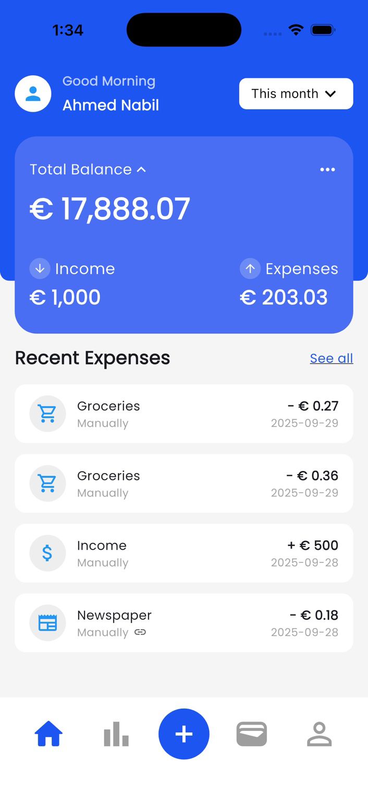
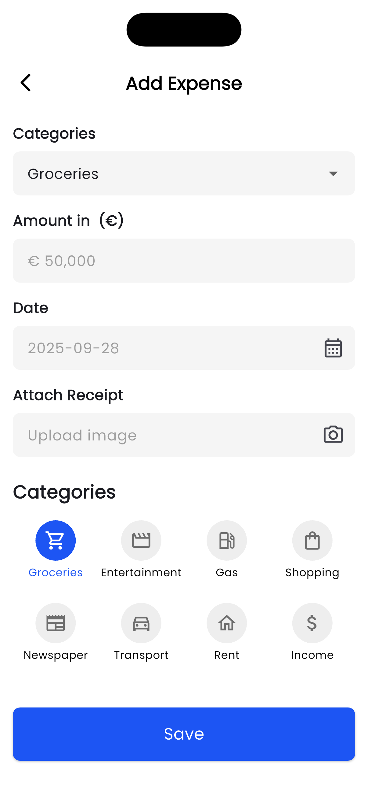
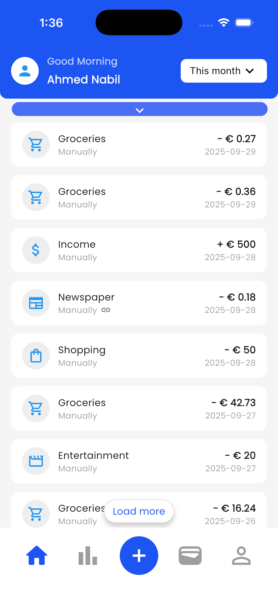

# expense_tracker_lite

A lightweight expense tracking app.

## Build Instructions

To build and run the project, follow these steps:

1. Make sure you have both `git` and `flutter` SDK installed on your device.
2. Clone the repository by running:
   ```
   git clone https://github.com/AhmedEzio47/expense_tracker_lite.git
   ```
3. Get the project dependencies by running:
   ```
   flutter pub get
   ```
4. Run the app on an emulator or connected device using:
   ```
   flutter run --dart-define=APP_ID=your_api_key
   ```
5. If you want to easily test the app on Android, you can download the
   APK [here](https://drive.google.com/file/d/1JIAMA-SLWO2F960hFE8CbZ_J9eFVAykQ/view?usp=sharing):

## Architecture

This app follows the Clean Architecture pattern, which promotes testability, separation of concerns,
and maintainability. By organizing the code into distinct layers, it becomes easier to manage
dependencies and scale the application over time.

## Database

For local data storage, the app utilizes `Drift` which is built on top of `SQLite`, it's used for storing expenses data.
The app also utilizes `Hive` which is a lightweight and fast key-value database that works
well with Flutter, it's used for caching as a part of the network layer in the `flutter_common_package`.
Both `Drift` and `Hive` do not require a platform-specific database setup, making them easy to
integrate and maintain across different platforms. And it can be integrated with `dio` easily
by using `dio_cache_interceptor_hive_store`

## State management

The app uses **BLoC (Business Logic Component)** as the state management solution. BLoC was chosen because it enforces a clear separation of concerns between the UI and business logic, which makes the codebase more maintainable and testable.  

Key benefits of using BLoC in this project:
- **Scalability**: BLoC works well for small features as well as complex modules, allowing the app to grow without architectural compromises.  
- **Testability**: By isolating logic in blocs, unit and widget testing becomes straightforward.  
- **Consistency**: State changes are predictable and explicit, reducing the likelihood of unexpected side effects.  
- **Integration**: BLoC integrates smoothly with Flutter’s widget tree and complements the Clean Architecture pattern already used in the project.  

## API Integration for Currency Conversion

To support real-time currency conversion, I implemented a repository layer that integrates with an external exchange rates API. 
The integration is encapsulated in the CurrencyRepoImpl class, which follows the repository pattern to keep the data layer clean, testable, and decoupled from the presentation layer.

- **Repository Implementation**:  
  - The CurrencyRepoImpl class implements the CurrencyRepo interface, ensuring consistency across different repository implementations.  
  - It relies on a shared NetworkManager (`flutter_common_package`) to handle HTTP requests and responses in a unified way across the project.  

- **API Request**:  
  - The repository fetches exchange rates from the [open exchange rates API](https://openexchangerates.org).  
  - The request dynamically replaces the {date} parameter in the endpoint to allow historical exchange rate queries in addition to the latest rates.  
  - Parameters such as app_id (from build-time environment variables) and base (the source currency) are included in the query.  

- **Response Handling**:  
  - The raw API response is parsed into a strongly typed ExchangeRatesModel using a background isolate (Isolate.run) to avoid blocking the main thread during heavy JSON deserialization.  
  - Results are wrapped using the Result type (Right for success, Left for failure) to provide a safe, functional approach for error handling.  

- **Error Handling**:  
  - Any network or parsing errors are caught and converted into a unified AppException type.  
  - This ensures that the presentation layer receives consistent and meaningful error objects.

## Pagination Strategy

The app uses a page-based pagination strategy to efficiently load expenses without overwhelming the UI or database.

- **ExpensesRepoImpl**:
   - The `getExpenses` method accepts a `page` parameter and applies a `limit` and `offset` when querying the database.
   - The offset is calculated as `kPerPage * (page - 1)`, ensuring each page fetches a distinct set of results.
   - Results are ordered by date in descending order, so the latest expenses always appear first.

- **ExpensesBloc**:
   - The bloc tracks the current page and requests the next page when the user taps load more button.
   - Newly fetched expenses are appended to the existing state.
   - The bloc also manages loading, empty and error states.

## Assumptions and trade-offs
   - The categories are made static and stored as an enum for simplicity, 
      while storing it as a database table is better for flexibility and scalability,
      but using enums saved much time for more the required features.
   - Stored the user name and the initial balance as constant variable for the same reason; simplicity and time saving
   - The selected currency is persisted across the app and stored in shared prefs, and the user inputs the amount in that currency.
      This approach is chosen, so the design of the add expense screen stays the same and for better UX in my opinion.
      The user can selects it in the profile screen.
   - See all button expands the list in place instead of navigating to a dedicated screen


## Screenshots










